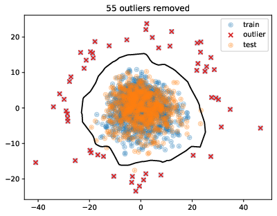
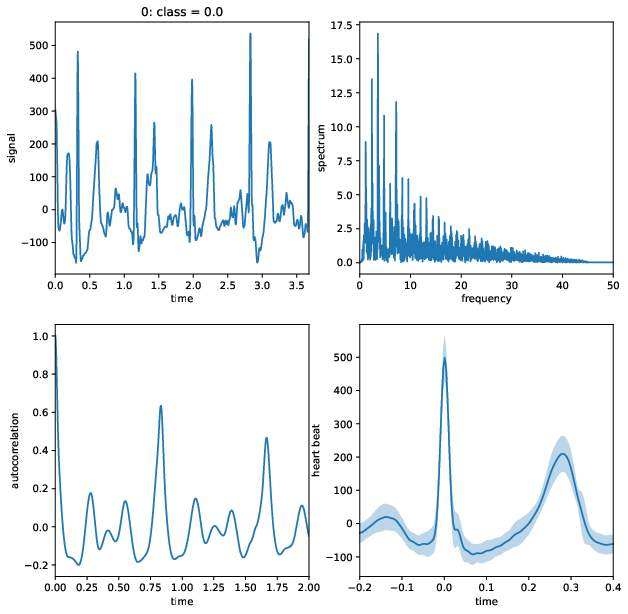

# Advanced Machine Learning Projects

Codes for the 2023 ETH Zürich course [Advanced Machine Learning](https://ml2.inf.ethz.ch/courses/aml/).

# Task 1: Predict the age of a brain from MRI features

1. Outlier removal
    - Remove median and scale data according to interquartile range
    - Imputation for missing values using k-Nearest Neighbors
    - Principal component analysis, reduction to 2 components
    - Isolation Forest Algorithm, with contamination of 4.5% to detect/remove outliers (55)
2. Preprocessing + feature selection
    - Standardize features by removing the mean and scaling to unit variance
    - Imputation for missing values using k-Nearest Neighbors
    - Remove features that have zero variance
    - Select the 200 features that have the highest correlation with target
    - Select features based on importance weights of Lasso regression (74)
3. Model selection
    - Stacked regression model consisting of
        - Support Vector Regression
        - Histogram-based Gradient Boosting Regression Tree
        - Extra-trees regressor
        - Multi-layer Perceptron regressor
    - All hyperparameters are found/validated through 10-fold cross-validated grid search

  

# Task 2: Heart rhythm classification from raw ECG signals

1. feature extraction
    - use biosppy to extract raw features (cleaned signal, rpeaks, heart beats, heart rate)
    - find S, Q, P, and T points using neurokit
    - some of the signals are inverted, to combat this we add the inverse of all signals
    - use binned FFT and autocorrelation of full spectrum
    - compute various time intervals between R, S, Q, P, and T points (and their on/offsets)
    - use mean, standard deviation, median, and variance of the features
2. preprocessing
    - because the dataset is imbalanced, we use random over sampling
    - scale every feature to zero mean and unit variance
3. training
    - use HistGradientBoostingClassifier from sklearn
    - optimize hyper parameters with RandomizedGridSearchCV

  

# Task 3: Mitral valve segmentation

1. preprocessing
    - images are padded to be square and rescaled to 128x128 pixels
    - move the frame axis of videos and labels to the front
2. box prediction
    - use Attention R2U-Net to predict boxes
    - use Adam optimizer and BCEWithLogitsLoss loss
    - augment images by
        - random erasing of image portion
        - random affine transformation (rotate, translate, scale, shear)
        - random perspective
    - train first on amateur data, then on expert data
    - split train/validation set over patients not frames
    - train with batch size 16, until the best validation score does not decrease for 3 epochs
    - average all boxes for one video, use threshold of 0.5 to create binary mask
3. movement computation
    - use robust non-negative matrix factorization to detect moving pixels in videos
    - rank=2 and sparsity=0.1
    - normalize videos and movement to be between 0 and 1
4. valve segmentation
    - use Attention R2U-Net to predict boxes
    - use Adam optimizer and BCEWithLogitsLoss loss
    - augment images by
        - random erasing of image portion in the shape of a circle from a random point in the label
            - mimics occlusion of valve in unlabeled frames
        - random affine transformation (rotate, translate, scale, shear)
        - random perspective
    - assemble inputs as 3 channel stacked tensors (frame, box, movement)
    - train first on amateur data, then on expert data
    - split train/validation set over patients not frames
    - train with batch size 8, until the best validation score does not decrease for 5 epochs
    - use threshold of 0.5 for each prediction
5. postprocessing
    - rescale to original size and remove padding
    - move frame axis back to the rear

  

